# HIPAA Transactions API - Entity Relationship Diagram

## Overview
This document provides the Entity Relationship Diagrams (ERD) for the HIPAA Transactions API database structure based on Availity's developer documentation.

---

## 1. Coverage Management System

### Main Coverage ERD

---

## 2. Plans and Benefits Structure

```mermaid
erDiagram
    COVERAGE ||--o{ PLANS : "includes"
    PLANS ||--o{ BENEFITS : "offers"
    PLANS ||--o{ ADDITIONAL_PAYERS : "coordinates_with"
    PLANS ||--o{ PRIMARY_CARE_PROVIDER : "assigned_to"

    BENEFITS ||--|| BENEFIT_DETAIL : "has"
    BENEFITS ||--|| AMOUNTS : "includes"
    BENEFIT_DETAIL ||--o{ NETWORK_BENEFIT : "in_network"
    BENEFIT_DETAIL ||--o{ NETWORK_BENEFIT : "out_of_network"
    BENEFIT_DETAIL ||--o{ NETWORK_BENEFIT : "not_applicable_network"
    BENEFIT_DETAIL ||--o{ NETWORK_BENEFIT : "no_network"

    AMOUNTS ||--o| CO_PAYMENT : "has"
    AMOUNTS ||--o| OUT_OF_POCKET : "has"
    AMOUNTS ||--o| DEDUCTIBLES : "has"
    AMOUNTS ||--o| CO_INSURANCE : "has"

    PLANS {
        string planId PK "Plan identifier"
        string coverageId FK "Coverage reference"
        string status "Coverage status"
        string statusCode "Status code"
        string identityCardNumber "ID card number"
        string groupNumber "Group number"
        string groupName "Group name"
        string policyNumber "Policy number"
        string planNumber "Plan number"
        string planName "Plan name"
        string planNetworkId "Plan network ID"
        string planNetworkName "Plan network name"
        string description "Plan description"
        datetime eligibilityStartDate "Eligibility start"
        datetime eligibilityEndDate "Eligibility end"
        datetime coverageStartDate "Coverage start"
        datetime coverageEndDate "Coverage end"
        string insuranceType "Insurance type"
        string insuranceTypeCode "Insurance type code"
        string contractClassCode "Contract class code"
        string contractNumber "Contract number"
        string medicalRecordNumber "Medical record number"
        string healthInsuranceClaimNumber "Medicare beneficiary ID"
        datetime admissionDate "Admission date"
        datetime dischargeDate "Discharge date"
        datetime planStartDate "Plan start date"
        datetime planEndDate "Plan end date"
        datetime planEnrollmentDate "Enrollment date"
        datetime certificationDate "Certification date"
        datetime lastUpdateDate "Last update"
        datetime statusDate "Status date"
    }

    BENEFITS {
        string benefitId PK "Benefit identifier"
        string planId FK "Plan reference"
        string name "Benefit name"
        string type "Benefit type"
        string source "Procedure benefit source"
        string status "Coverage status"
        string statusCode "Status code"
    }

    BENEFIT_DETAIL {
        string benefitId FK "Benefit reference"
        string detailType "Detail type (in/out/not_applicable/no network)"
    }

    NETWORK_BENEFIT {
        string networkBenefitId PK "Network benefit ID"
        string benefitDetailId FK "Benefit detail reference"
        string status "Benefit status"
        string statusCode "Status code"
        string insuranceType "Insurance type"
        string insuranceTypeCode "Insurance type code"
        string amount "Benefit amount"
        string units "Benefit units"
        string amountTimePeriod "Time period"
        string amountTimePeriodCode "Time period code"
        string remaining "Remaining amount"
        string remainingTimePeriod "Remaining period"
        string total "Total amount"
        string totalTimePeriod "Total period"
        string level "Benefit level"
        string levelCode "Level code"
        string quantity "Quantity"
        string quantityQualifier "Quantity qualifier"
        string quantityQualifierCode "Qualifier code"
        boolean authorizationRequired "Authorization required flag"
        boolean authorizationRequiredUnknown "Unknown authorization flag"
        string placeOfService "Place of service"
        string placeOfServiceCode "Place of service code"
        string description "Benefit description"
        datetime eligibilityStartDate "Eligibility start"
        datetime eligibilityEndDate "Eligibility end"
        datetime serviceDate "Service date"
    }

    AMOUNTS {
        string benefitId FK "Benefit reference"
    }

    CO_PAYMENT {
        string amountId FK "Amount reference"
        string amount "Copayment amount"
    }

    OUT_OF_POCKET {
        string amountId FK "Amount reference"
        string amount "Out-of-pocket amount"
    }

    DEDUCTIBLES {
        string amountId FK "Amount reference"
        string amount "Deductible amount"
    }

    CO_INSURANCE {
        string amountId FK "Amount reference"
        string percentage "Coinsurance percentage"
    }

    ADDITIONAL_PAYERS {
        string additionalPayerId PK "Additional payer ID"
        string planId FK "Plan reference"
        string name "Payer name"
        string serviceTypeCode "Service type code"
        string insuredMemberId "Insured member ID"
        boolean primary "Primary payer flag"
        boolean secondary "Secondary payer flag"
        boolean tertiary "Tertiary payer flag"
        date coordinationOfBenefitsBeginDate "COB begin date"
        date coordinationOfBenefitsEndDate "COB end date"
        date coordinationOfBenefitsDate "COB date"
    }

    PRIMARY_CARE_PROVIDER {
        string pcpId PK "PCP identifier"
        string planId FK "Plan reference"
        string npi "Provider NPI"
        string name "Provider name"
        datetime primaryCareProviderDate "PCP date"
    }
```

---

## 3. Payer List and Processing Routes

---

## 4. Configuration and Elements

---

## 5. Service Reviews

---

## 6. Provider Delivery Information

---

## Relationship Summary

### One-to-One Relationships
- `COVERAGE` ↔ `PAYER`
- `COVERAGE` ↔ `REQUESTING_PROVIDER`
- `COVERAGE` ↔ `PATIENT`
- `COVERAGE` ↔ `SUBSCRIBER`
- `COVERAGE` ↔ `SUPPLEMENTAL_INFORMATION` (optional)
- `COVERAGE` ↔ `REMINDERS` (optional)
- `BENEFITS` ↔ `BENEFIT_DETAIL`
- `BENEFITS` ↔ `AMOUNTS`
- `CONFIGURATIONS` ↔ `ELEMENTS` (root)

### One-to-Many Relationships
- `COVERAGE` → `PLANS` (one coverage can have multiple plans)
- `COVERAGE` → `VALIDATION_MESSAGES` (one coverage can have multiple validation messages)
- `PLANS` → `BENEFITS` (one plan can offer multiple benefits)
- `PLANS` → `ADDITIONAL_PAYERS` (one plan can coordinate with multiple payers)
- `PLANS` → `PRIMARY_CARE_PROVIDER` (one plan can have multiple PCPs)
- `BENEFIT_DETAIL` → `NETWORK_BENEFIT` (detail has in-network, out-of-network variants)
- `PAYER_LIST` → `PROCESSING_ROUTES` (one payer supports multiple routes)
- `ELEMENTS` → `ELEMENTS` (parent-child hierarchy)
- `ELEMENTS` → `CONDITIONAL_FIELDS` (one element can have multiple conditions)
- `SERVICE_REVIEW` → `DIAGNOSES` (one review can include multiple diagnoses)
- `SERVICE_REVIEW` → `PROCEDURES` (one review can include multiple procedures)
- `SERVICE_REVIEW` → `RENDERING_PROVIDERS` (one review can have multiple rendering providers)
- `SERVICE_REVIEW` → `TRANSPORT_LOCATIONS` (one review can have multiple locations)
- `REQUESTING_PROVIDER` → `DELIVERY_INFORMATION` (one provider can have multiple delivery schedules)

---

## Key Entities Description

### Primary Entities

1. **COVERAGE**: Central entity representing eligibility/benefits verification requests
2. **SERVICE_REVIEW**: Represents authorization/referral requests
3. **PAYER_LIST**: Master list of health insurance payers
4. **CONFIGURATIONS**: Dynamic form configurations per payer/transaction type

### Supporting Entities

- **PAYER**: Health insurance plan information
- **PATIENT**: Patient demographic information
- **SUBSCRIBER**: Primary insurance subscriber information
- **REQUESTING_PROVIDER**: Healthcare provider requesting services/verification
- **PLANS**: Insurance plan details and coverage information
- **BENEFITS**: Specific benefit types and coverage details

### Transactional Entities

- **VALIDATION_MESSAGES**: Error/warning messages from payer responses
- **PAYER_NOTES**: General disclaimers and messages from health plans
- **PROVIDER_NOTES**: Notes from requesting providers
- **DIAGNOSES**: Diagnosis codes for service reviews
- **PROCEDURES**: Procedure codes for service reviews

---

## Database Normalization Notes

The database structure follows normalization principles:

- **1NF (First Normal Form)**: All tables have atomic values
- **2NF (Second Normal Form)**: Non-key attributes depend on primary keys
- **3NF (Third Normal Form)**: No transitive dependencies

### Denormalization Considerations

Some fields are intentionally denormalized for API performance:
- Status codes stored alongside status descriptions
- Type codes stored alongside type descriptions
- Date ranges stored in multiple formats for different query patterns

---

## Indexes Recommendations

### Primary Indexes
- All `id` fields (Primary Keys)
- All foreign key fields

### Secondary Indexes
- `COVERAGE.customerId`, `COVERAGE.controlNumber`, `COVERAGE.status`
- `PATIENT.memberId`, `PATIENT.lastName`, `PATIENT.birthDate`
- `SUBSCRIBER.memberId`
- `PAYER.payerId`
- `REQUESTING_PROVIDER.npi`, `REQUESTING_PROVIDER.taxId`
- `SERVICE_REVIEW.controlNumber`, `SERVICE_REVIEW.status`
- `PLANS.groupNumber`, `PLANS.planNumber`

### Composite Indexes
- `COVERAGE(customerId, status, createdDate)` - For coverage searches
- `PATIENT(lastName, firstName, birthDate)` - For patient lookups
- `SERVICE_REVIEW(customerId, status, createdDate)` - For review searches

---

## API Endpoint to Entity Mapping

### Coverage APIs
- `POST /v1/coverages` → Creates `COVERAGE` + related entities
- `GET /v1/coverages` → Searches `COVERAGE` table
- `GET /v1/coverages/{id}` → Retrieves `COVERAGE` with all relationships
- `POST /v1/coverages/search` → Advanced `COVERAGE` search

### Service Review APIs
- `POST /v2/service-reviews` → Creates `SERVICE_REVIEW` + related entities
- `GET /v2/service-reviews` → Searches `SERVICE_REVIEW` table
- `GET /v2/service-reviews/{id}` → Retrieves `SERVICE_REVIEW` with relationships
- `PUT /v2/service-reviews` → Updates `SERVICE_REVIEW`
- `DELETE /v2/service-reviews/{id}` → Voids `SERVICE_REVIEW`

### Payer List APIs
- `GET /v1/payers` → Queries `PAYER_LIST` and `PROCESSING_ROUTES`

### Configuration APIs
- `GET /v1/configurations` → Queries `CONFIGURATIONS` and `ELEMENTS`

---

## Data Flow

---

## Document Version
- **Version**: 1.0
- **Last Updated**: 2025-01-18
- **Source**: Availity HIPAA Transactions API Documentation
- **Based on**: 37 Database Tables
