# HIPAA-Compliant AI Application Architecture - Mermaid Diagrams

## 🎯 COMPLETE SYSTEM ARCHITECTURE - Single Summary Diagram

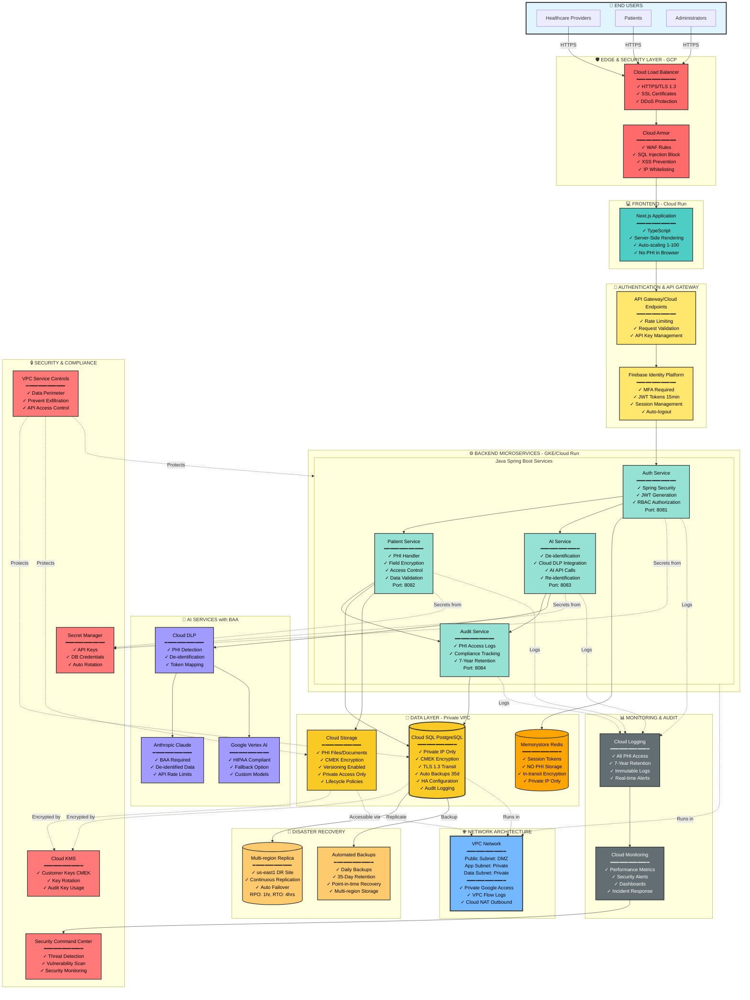

### 📋 Architecture Summary Legend

| Color           | Layer          | Components                                   |
| --------------- | -------------- | -------------------------------------------- |
| 🔴 **Red**      | Edge Security  | Load Balancer, Cloud Armor (WAF/DDoS)        |
| 🟡 **Yellow**   | Authentication | API Gateway, Firebase Auth + MFA             |
| 🟢 **Green**    | Application    | Java Spring Boot Microservices               |
| 🟠 **Orange**   | Data Storage   | Cloud SQL, Cloud Storage, Redis              |
| 🟣 **Purple**   | AI Services    | Cloud DLP, Claude API, Vertex AI             |
| 🔴 **Pink/Red** | Security       | Cloud KMS, Secret Manager, VPC Controls, SCC |
| ⚫ **Gray**     | Monitoring     | Cloud Logging, Cloud Monitoring              |
| 🟡 **Gold**     | DR/Backup      | Multi-region Replica, Automated Backups      |
| 🔵 **Blue**     | Network        | VPC with Private Subnets                     |

### 🔒 Key HIPAA Security Features

✅ **Encryption:** All data encrypted at rest (CMEK) and in transit (TLS 1.3)  
✅ **Access Control:** MFA required, JWT tokens (15 min), RBAC, auto-logout  
✅ **PHI Protection:** De-identification before AI, field-level encryption  
✅ **Audit Logging:** All PHI access logged, 7-year retention, immutable  
✅ **Network Security:** Private VPC, no public database access, VPC Service Controls  
✅ **Disaster Recovery:** Multi-region replication, 35-day backups, RPO: 1hr, RTO: 4hrs  
✅ **Monitoring:** Real-time security alerts, threat detection, vulnerability scanning  
✅ **Compliance:** BAA with all GCP services and AI providers

### 🔄 Data Flow

1. **User Request** → Edge Security → Frontend → API Gateway
2. **Authentication** → Firebase Auth (MFA) → JWT Token (15 min)
3. **Authorization** → Spring Security RBAC → Access Control
4. **PHI Access** → Encrypted Database → Audit Log → Cloud Logging
5. **AI Processing** → De-identify (DLP) → Claude/Vertex AI → Re-identify
6. **All Actions** → Logged → 7-Year Retention → Compliance Reports

---

## 1. High-Level System Architecture

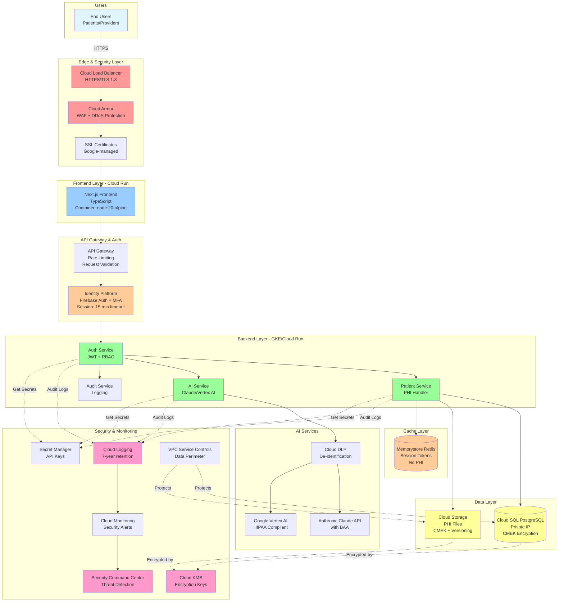

## 2. Network Architecture with VPC

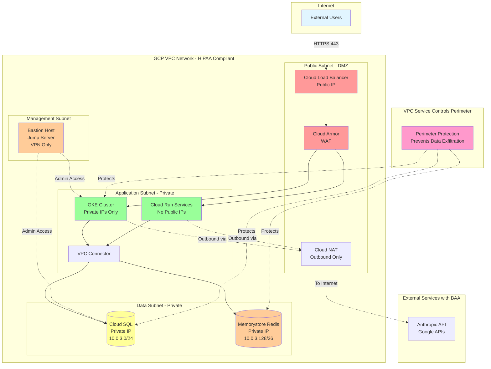

## 3. Security Layers & Data Flow

```mermaid
graph LR
    subgraph "Layer 1: Edge Security"
        L1A[Cloud Armor<br/>DDoS Protection]
        L1B[WAF Rules<br/>SQL Injection<br/>XSS Prevention]
        L1C[IP Whitelisting<br/>Geo-blocking]
    end

    subgraph "Layer 2: Authentication"
        L2A[Firebase Auth<br/>+ MFA Required]
        L2B[JWT Tokens<br/>15 min expiry]
        L2C[Session Management<br/>Auto-logout]
    end

    subgraph "Layer 3: Authorization"
        L3A[Spring Security<br/>RBAC]
        L3B[Role Validation<br/>Admin/Provider/Patient]
        L3C[Resource-level<br/>Access Control]
    end

    subgraph "Layer 4: Application Security"
        L4A[Input Validation<br/>Bean Validation]
        L4B[SQL Injection<br/>Prevention - JPA]
        L4C[CSRF Protection<br/>Spring Security]
    end

    subgraph "Layer 5: Data Security"
        L5A[Encryption at Rest<br/>CMEK via Cloud KMS]
        L5B[Encryption in Transit<br/>TLS 1.3]
        L5C[Field-level Encryption<br/>Sensitive PHI]
    end

    subgraph "Layer 6: Audit & Monitoring"
        L6A[Cloud Logging<br/>All PHI Access]
        L6B[Audit Triggers<br/>Database Level]
        L6C[Security Alerts<br/>Anomaly Detection]
    end

    L1A --> L1B --> L1C --> L2A
    L2A --> L2B --> L2C --> L3A
    L3A --> L3B --> L3C --> L4A
    L4A --> L4B --> L4C --> L5A
    L5A --> L5B --> L5C --> L6A
    L6A --> L6B --> L6C

    style L1A fill:#ff9999
    style L1B fill:#ff9999
    style L1C fill:#ff9999
    style L2A fill:#ffcc99
    style L2B fill:#ffcc99
    style L2C fill:#ffcc99
    style L3A fill:#99ff99
    style L3B fill:#99ff99
    style L3C fill:#99ff99
    style L4A fill:#99ccff
    style L4B fill:#99ccff
    style L4C fill:#99ccff
    style L5A fill:#ff99cc
    style L5B fill:#ff99cc
    style L5C fill:#ff99cc
    style L6A fill:#cc99ff
    style L6B fill:#cc99ff
    style L6C fill:#cc99ff
```

## 4. Microservices Architecture

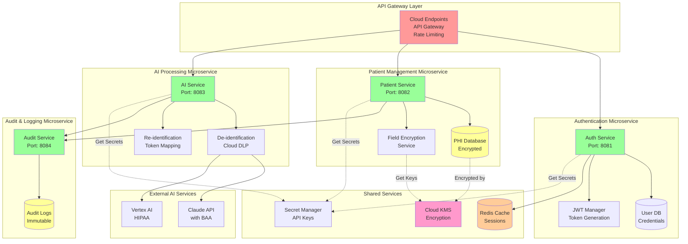

## 5. Authentication & Authorization Flow

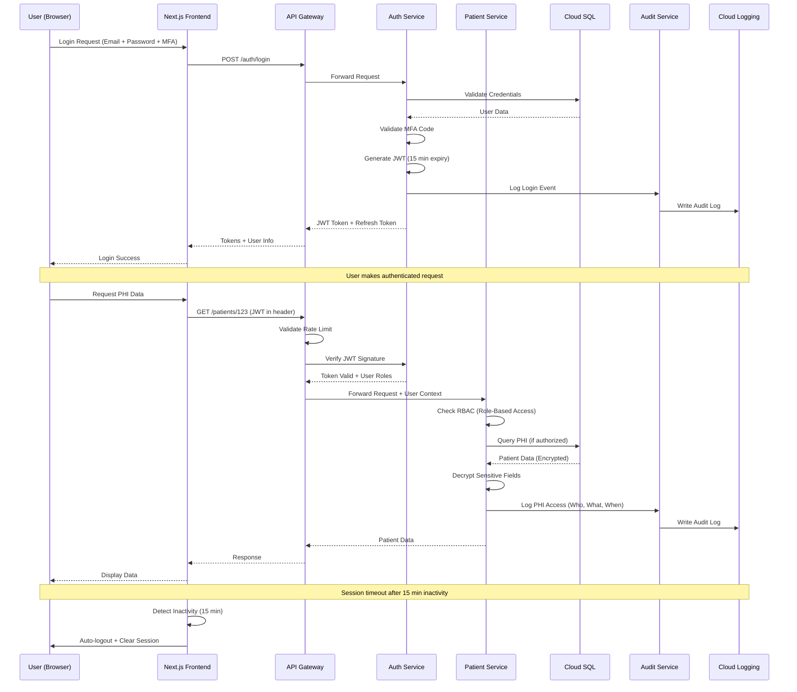

## 6. AI Processing with PHI De-identification

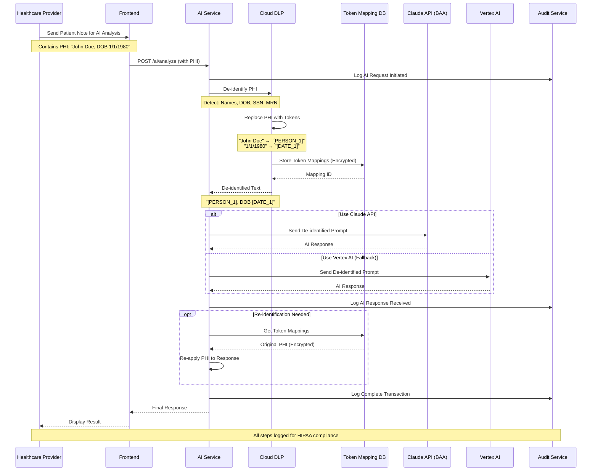

## 7. Data Encryption Architecture

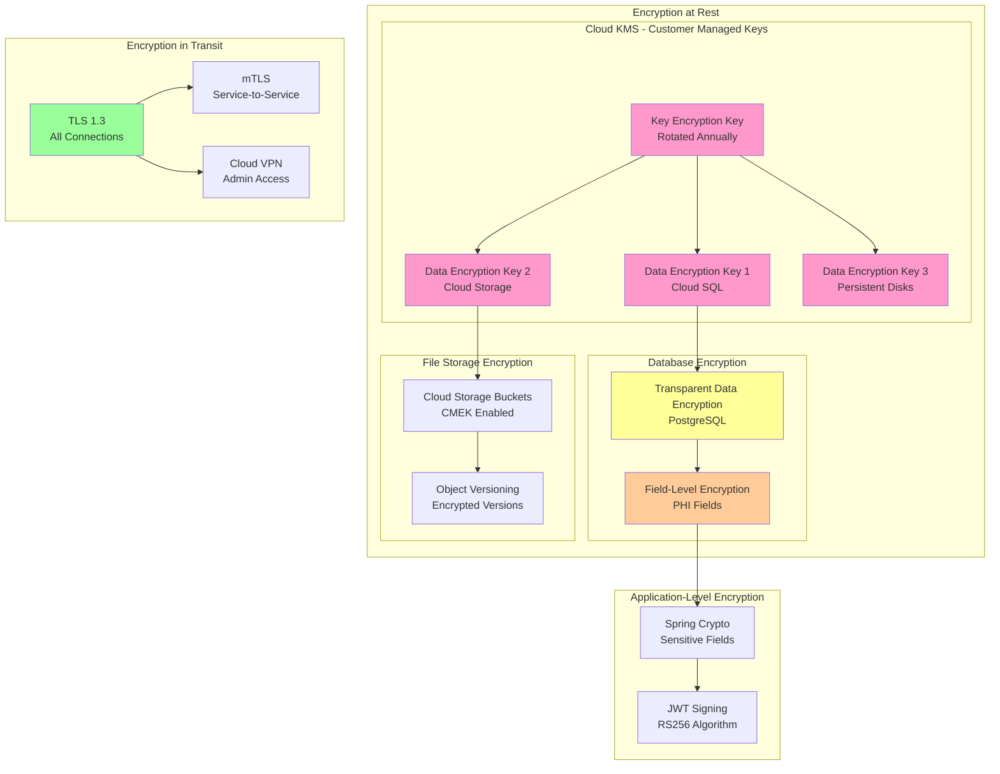

## 8. Backup & Disaster Recovery Flow

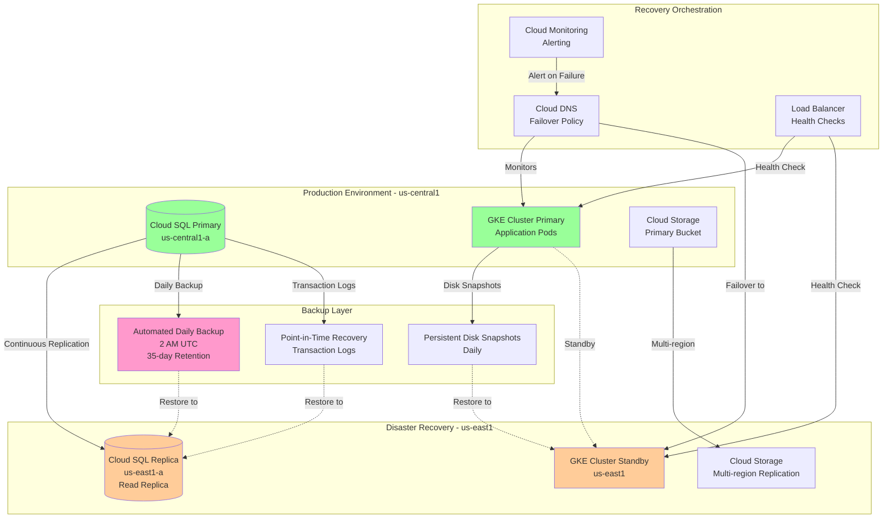

## 9. Monitoring & Audit Logging

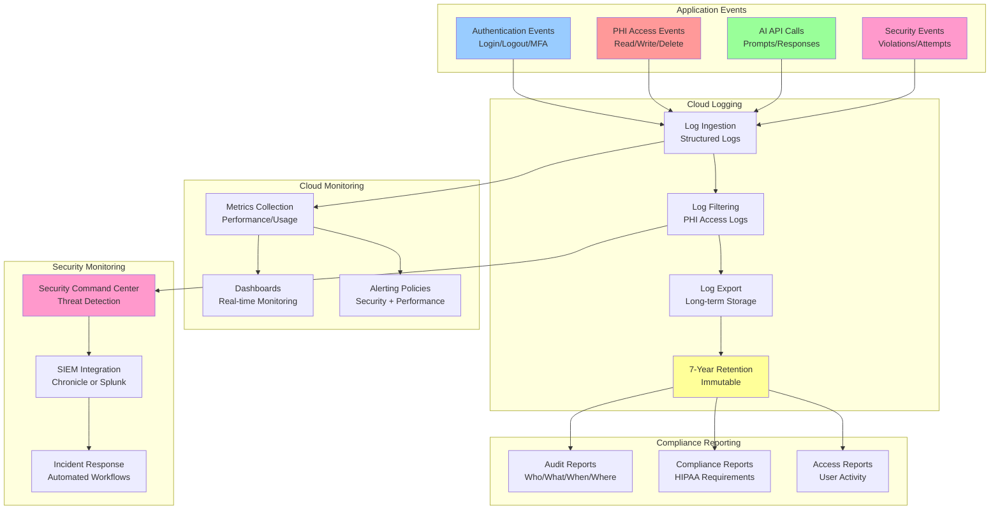

## 10. Java Spring Boot Application Structure

```mermaid
graph TB
    subgraph "Controller Layer"
        AC[AuthController<br/>/api/auth/**]
        PC[PatientController<br/>/api/patients/**]
        AIC[AIController<br/>/api/ai/**]
    end

    subgraph "Security Layer"
        SEC_CONF[SecurityConfig<br/>Spring Security]
        JWT_FILT[JwtAuthenticationFilter<br/>Token Validation]
        RBAC[RoleBasedAccessControl<br/>@PreAuthorize]
    end

    subgraph "Service Layer"
        AUTH_SVC[AuthService<br/>Login/JWT Logic]
        PAT_SVC[PatientService<br/>Business Logic]
        AI_SVC[AIService<br/>AI Integration]
        DEID_SVC[DeidentificationService<br/>Cloud DLP]
        ENC_SVC[EncryptionService<br/>Field Encryption]
        AUDIT_SVC[AuditService<br/>Logging]
    end

    subgraph "Repository Layer"
        USER_REPO[(UserRepository<br/>JPA)]
        PAT_REPO[(PatientRepository<br/>JPA)]
        AUDIT_REPO[(AuditLogRepository<br/>JPA)]
    end

    subgraph "External Services"
        DB[(Cloud SQL<br/>PostgreSQL)]
        REDIS[(Memorystore<br/>Redis)]
        KMS[Cloud KMS<br/>Encryption]
        DLP[Cloud DLP<br/>De-identification]
        CLAUDE_API[Claude API]
    end

    AC --> SEC_CONF
    PC --> SEC_CONF
    AIC --> SEC_CONF

    SEC_CONF --> JWT_FILT
    JWT_FILT --> RBAC

    AC --> AUTH_SVC
    PC --> PAT_SVC
    AIC --> AI_SVC

    PAT_SVC --> ENC_SVC
    PAT_SVC --> AUDIT_SVC
    AI_SVC --> DEID_SVC
    AI_SVC --> AUDIT_SVC

    AUTH_SVC --> USER_REPO
    PAT_SVC --> PAT_REPO
    AUDIT_SVC --> AUDIT_REPO

    USER_REPO --> DB
    PAT_REPO --> DB
    AUDIT_REPO --> DB

    AUTH_SVC --> REDIS
    ENC_SVC --> KMS
    DEID_SVC --> DLP
    AI_SVC --> CLAUDE_API

    style AC fill:#99ccff
    style PC fill:#99ccff
    style AIC fill:#99ccff
    style SEC_CONF fill:#ff9999
    style AUTH_SVC fill:#99ff99
    style PAT_SVC fill:#99ff99
    style AI_SVC fill:#99ff99
    style DB fill:#ffff99
```

## 11. Database Schema with Encryption

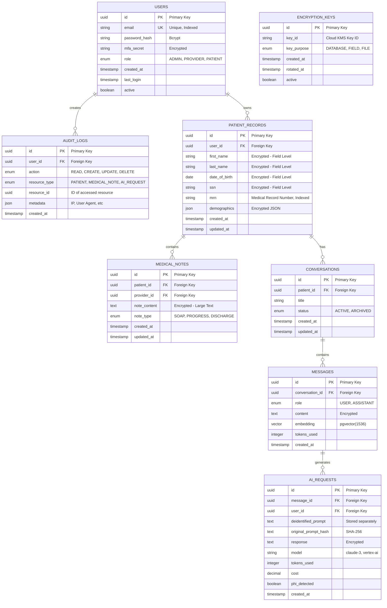

## 12. CI/CD Pipeline with Security Checks

```mermaid
graph LR
    subgraph "Development"
        DEV[Developer<br/>Local Development]
        GIT[Git Commit<br/>Feature Branch]
    end

    subgraph "CI - Cloud Build"
        TRIG[Trigger<br/>on Push/PR]
        LINT[Linting<br/>Checkstyle/ESLint]
        TEST[Unit Tests<br/>JUnit/Jest]
        SEC_SCAN[Security Scanning<br/>OWASP Dependency Check]
        SAST[SAST Analysis<br/>SonarQube]
        BUILD[Build Container<br/>Docker Image]
    end

    subgraph "Security Gates"
        VULN[Vulnerability Scan<br/>Trivy/Snyk]
        SECRETS[Secret Detection<br/>GitGuardian]
        COMP[Compliance Check<br/>HIPAA Requirements]
    end

    subgraph "Artifact Storage"
        GAR[Google Artifact Registry<br/>Signed Images]
    end

    subgraph "CD - Deployment"
        STAGE[Deploy to Staging<br/>Cloud Run/GKE]
        INTEG[Integration Tests<br/>API Testing]
        PEN[Penetration Testing<br/>OWASP ZAP]
        APPROVE[Manual Approval<br/>Security Review]
        PROD[Deploy to Production<br/>Blue-Green]
    end

    subgraph "Post-Deployment"
        MON[Monitoring<br/>Cloud Monitoring]
        ALERT[Security Alerts<br/>Incidents]
    end

    DEV --> GIT
    GIT --> TRIG
    TRIG --> LINT
    LINT --> TEST
    TEST --> SEC_SCAN
    SEC_SCAN --> SAST
    SAST --> BUILD

    BUILD --> VULN
    BUILD --> SECRETS
    BUILD --> COMP

    VULN -->|Pass| GAR
    SECRETS -->|Pass| GAR
    COMP -->|Pass| GAR

    GAR --> STAGE
    STAGE --> INTEG
    INTEG --> PEN
    PEN -->|Pass| APPROVE
    APPROVE -->|Approved| PROD

    PROD --> MON
    MON --> ALERT

    style VULN fill:#ff9999
    style SECRETS fill:#ff9999
    style COMP fill:#ff9999
    style APPROVE fill:#ffcc99
    style PROD fill:#99ff99
```

---

## Notes on Diagrams

**Color Legend:**

- 🔴 Red/Pink: Security & Authentication layers
- 🟢 Green: Application/Service layers
- 🟡 Yellow: Data storage layers
- 🟠 Orange: Caching & temporary storage
- 🔵 Blue: External users/interfaces
- 🟣 Purple: Monitoring & audit

**Key Security Features Highlighted:**

1. All PHI data is encrypted at rest and in transit
2. Private VPC with no public database access
3. De-identification before AI processing
4. Comprehensive audit logging (7-year retention)
5. Multi-layer security (Edge → Auth → Authorization → Encryption)
6. HIPAA-compliant services with BAA
7. Disaster recovery with multi-region replication

These diagrams can be rendered in any Mermaid-compatible viewer or tool!
